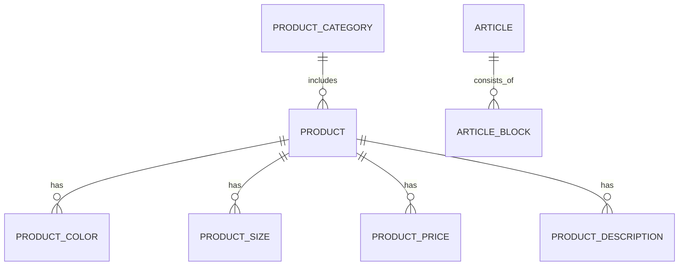

<!-- # ЛР2: Доменная модель и реляционная БД (BRUSKA)

## Описание доменной области
Проект BRUSKA — это витрина и контентный API для компании по производству и продаже тротуарной плитки, бордюров и сопутствующих материалов. Основные бизнес-объекты домена — каталог продукции, характеристики товаров (цвета, цены, размеры), статьи и структурированные блоки статей, а также навигационные элементы сайта.

## Выделенные сущности
1. `product_categories` — категории продукции.
2. `products` — карточки товаров каталога.
3. `product_colors` — доступные цвета товара.
4. `product_prices` — цены товара по цветам.
5. `product_sizes` — размерные характеристики товара.
6. `product_descriptions` — абзацы описания товара.
7. `articles` — статьи.
8. `article_blocks` — блоки контента внутри статьи.
9. `nav_items` — пункты меню сайта.

Минимальное требование ЛР (5+ сущностей со связями) выполнено.

## ER-диаграмма
Диаграмма в формате Mermaid: [ERD.mmd](./ERD.mmd)



## Что реализовано в коде
1. Подключён PostgreSQL в backend через `DATABASE_URL`.
2. Добавлен инфраструктурный слой БД:
   - `backend/internal/store/postgres/client.go`
   - `backend/internal/store/postgres/migrations.go`
3. Реализован механизм миграций через таблицу `schema_migrations`.
4. Реализован сидер данных из существующих JSON в SQL-таблицы:
   - `backend/internal/store/repositories/content_seed.go`
5. Контентный репозиторий переведён на чтение из PostgreSQL (с fallback на JSON):
   - `backend/internal/store/repositories/content_repository.go`
6. Подключение БД встроено в lifecycle приложения (`Start/Stop`):
   - `backend/internal/container/container.go`
   - `backend/internal/config/env.go`
   - `backend/internal/store/store.go`

## ЛР3: CRUD + SSE для статей

Добавлен выделенный поддомен администрирования статей с бизнес-логикой в сервисном слое и realtime-оповещениями через Server-Sent Events.

### Backend API (admin/articles)

- `GET /bruska/admin/articles`
- `GET /bruska/admin/articles/:id`
- `POST /bruska/admin/articles`
- `PATCH /bruska/admin/articles/:id`
- `DELETE /bruska/admin/articles/:id`
- `GET /bruska/admin/articles/events` (SSE)

### Frontend страницы админки

- `GET /admin/articles` — список статей, удаление, live-уведомления по SSE
- `GET /admin/articles/add` — отдельная страница создания
- `GET /admin/articles/:id/edit` — отдельная страница редактирования

## ЛР4: REST API и OpenAPI/Swagger

Добавлена спецификация OpenAPI и подключен Swagger UI для существующих REST-эндпоинтов backend.

- OpenAPI файл: `backend/docs/swagger/openapi.yaml`
- Swagger UI: `GET /bruska/swagger` (редирект на `/bruska/swagger/index.html`)

Документация включает:
- теги по модулям (`health`, `content`, `admin-articles`, `admin-products`);
- описание запросов/ответов;
- схемы DTO в `components.schemas`;
- коды статусов (`200/201/204/400/404/500`) для соответствующих endpoints.

## Локальный запуск через Docker (весь проект)
Из корня репозитория:

```bash
docker compose up --build
```

Будут подняты:
- `db` (PostgreSQL, порт `5432`)
- `backend` (Fiber API, порт `8080`)
- `frontend` (Next.js, порт `3000`)

Проверка API:

```bash
curl http://localhost:8080/bruska/healthcheck
curl http://localhost:8080/bruska/content/catalog
```

Открыть сайт:

```bash
http://localhost:3000
```

## Прод-сборка frontend: важная переменная
Для production обязательно задавайте `NEXT_PUBLIC_BACKEND_API_URL` перед сборкой frontend-образа, иначе в клиентский бандл попадет `localhost`.

Пример для сервера с IP `91.229.91.164`:

```bash
export NEXT_PUBLIC_BACKEND_API_URL=http://91.229.91.164:8080/bruska
docker compose build --no-cache frontend
docker compose up -d frontend
```

Проверить значение внутри compose можно командой:

```bash
docker compose config | grep NEXT_PUBLIC_BACKEND_API_URL
```

## Запуск только backend-части
Можно запустить compose внутри `backend/`:

```bash
cd backend
docker compose up --build
```

## Переменные окружения backend
- `DATABASE_URL` (например `postgres://bruska:bruska@db:5432/bruska?sslmode=disable`)
- `HTTP_PORT` (по умолчанию `8080`)
- `DATABASE_PING_TIMEOUT` (по умолчанию `5s`)
- `DATABASE_MAX_OPEN_CONNS` (по умолчанию `10`)
- `DATABASE_MAX_IDLE_CONNS` (по умолчанию `5`) -->

# Описание проекта и требований к приложению

Репозиторий представляет собой связку фронт + бек для сайта по продаже брусчатки.

## Стек

Фронт: React + Next + TS
Бек: Go + Postgres
Развертывание: VPS Beget + Docker

## Выполнение требований лаб

### Лаб1

- Сервис развернут на VPS Beget
- Шаблонизированы некоторые части приложения (напр. элементы хедера, повторяющиеся элементы, статьи и каталог)

### Лаб2

Развернута база данных

#### Основные сущности

1. `product_categories`
2. `products`
3. `product_colors`
4. `product_prices`
5. `product_sizes`
6. `product_descriptions`
7. `articles`
8. `article_blocks`
9. `nav_items`

#### Ключевые связи

1. `product_categories (1) -> (N) products`
2. `products (1) -> (N) product_colors`
3. `products (1) -> (N) product_prices`
4. `products (1) -> (N) product_sizes`
5. `products (1) -> (N) product_descriptions`
6. `articles (1) -> (N) article_blocks`

### Лаб3

Добавлены CRUD-операции для статей на backend:

- `GET /bruska/admin/articles`
- `GET /bruska/admin/articles/:id`
- `POST /bruska/admin/articles`
- `PATCH /bruska/admin/articles/:id`
- `DELETE /bruska/admin/articles/:id`

(в дальнейшем было изменено на GraphQL)

- Добавлена серверная бизнес-логика в сервисе:
  - валидация данных статьи;
  - создание/обновление/удаление;
  - генерация доменных событий изменения коллекции.

- Реализован SSE-эндпоинт:
  - `GET /bruska/admin/articles/events`

- Добавлена клиентская поддержка SSE через `EventSource`:
  - в админском списке статей отображаются живые уведомления о создании/изменении/удалении;
  - список автоматически обновляется при событии.

- Реализованы отдельные многостраничные формы для CRUD на frontend:
  - `GET /admin/articles`
  - `GET /admin/articles/add`
  - `GET /admin/articles/:id/edit`

### Лаб4

- Добавлена спецификация OpenAPI 3.0:
  - `backend/docs/swagger/openapi.yaml`

Ссылка на свагу: http://91.229.91.164:8080/bruska/swagger/index.html

### Лаб5

-Добавлен GraphQL endpoint и песочница:

  - `GET/POST /bruska/graphql`
  - в `GET` режиме открывается GraphiQL-песочница

- Реализована GraphQL-схема с `Query` и `Mutation` для предметной области:

  - каталог и статьи;
  - админские мутации статей/товаров;
  - пользователи: регистрация и логин

- Добавлена регистрация и авторизация пользователей в БД:
  - новая таблица `users` (миграция v3),
  - seed админа: `admin/admin`.

### Лаб6

1. Измерение времени обработки запроса:

- Добавлен middleware `backend/internal/server/middleware.go`.
- Для всех HTTP-запросов выставляется заголовок `X-Elapsed-Time`.
- Время и статус также пишутся в лог сервера.

2. Кэширование REST API:

- Для `/bruska/content/*` включена генерация `ETag`.
- Для контентных GET-эндпоинтов выставляется `Cache-Control: public, max-age=3600, must-revalidate`.
- Для `/bruska/content/catalog` добавлено server-side in-memory кэширование с TTL `5s`.

3. Загрузка файлов в Object Storage:

- Добавлен инфраструктурный модуль `backend/internal/infrastructure/objectstorage/client.go`
- Upload-эндпоинты админки загружают файлы в Yandex Object Storage и возвращают публичный URL.
- Эндпоинты контент-ассетов (`slides`, `preview`, `color-image`) работают с Object Storage (fallback на локальные файлы сохранен).

### Лаб7

1. Backend: аутентификация Firebase ID Token (Bearer)

- Добавлен инфраструктурный модуль Firebase Admin SDK:
  - `backend/internal/infrastructure/firebaseauth/client.go`
- Верификация токена на backend через `Authorization: Bearer <idToken>`.
- Поддержка роли `admin`:
  - через claim `role=admin` / `admin=true`
  - и через allowlist UID в `FIREBASE_ADMIN_UIDS`.

2. Frontend: вход через Firebase

- Добавлен Firebase Web SDK + клиентская инициализация:
  - `frontend/shared/firebase/client.ts`
  - `frontend/shared/firebase/token.ts`
- Обновлена страница логина:
  - `frontend/app/admin-login/AdminLoginForm.tsx`
  - вход через Email/Password и Google.
- Обновлён `POST /api/admin-login`:
  - принимает Bearer токен
  - проверяет его через backend `/auth/session`
  - выставляет cookies `bruska_authorized`, `bruska_user`, `bruska_role`, `bruska_uid`.
